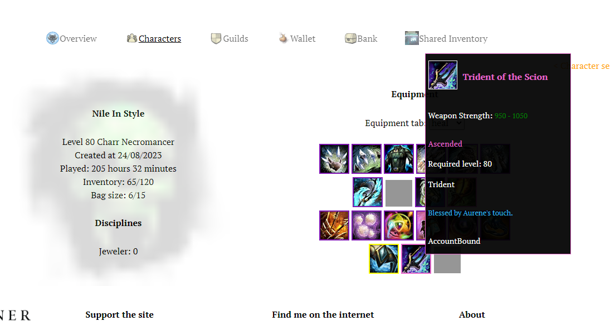

# Work in progress
### GW2Efficiency.com Clone
### Developed by Salim Caliskan

This is an update to the initial <a href="https://github.com/inthenile/gw2api">GW2 API Project</a> I made. The first project, I consider to be a small foray into learning how GW2 api worked, whereas this time I am also putting more effort into the functionality and usability of the app. This time I am using TypeScript with React, and trying to have my CSS better organised through modules. Although I am going to be keeping the API endpoints I use limited, I am hoping to have a more well-designed end-product.

# Run the code
```
1- Clone the repository.
2- Get an API key from https://account.arena.net/ , give it the desired permissions (the results might be affected)
3- npm install -> npm run dev
4- Save your api key and use the search options!
```

# Screenshots




# To-dos
Might add material storage and wardrobe storage.
Bosses, Crafting and Activities menus will 99% be removed.
Stats page is most likely going to be dedicated to WvW related stuff.
Like character equipments, charater builds MIGHT be added.
Lottery page will remain just as a fun (essentially non-functional) page, just to keep the site more in line as a gw2efficiency clone.
<s>For inventory/bank pages, I might add the amount of items as well.</s>